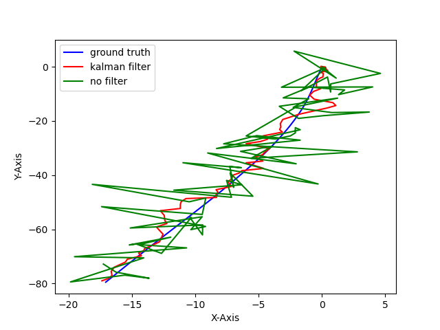
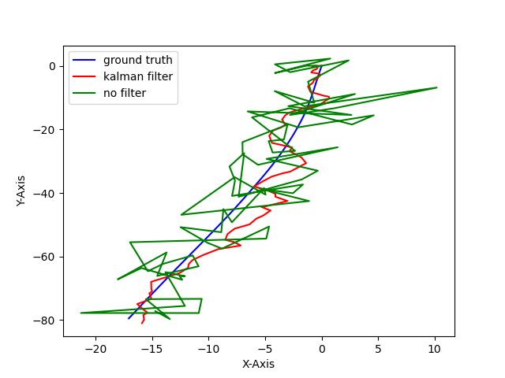

# EKF-kitti-GPS-IMU
Simple EKF with GPS and IMU data from kitti dataset for vehicle

## Usage
Just run below command at terminal
```
python EKF_GPS_IMU.py
```
Dependency: 
python 3.8.5
numpy: 1.19.2
matplotlib: 3.3.2

## Algorithm
1. dataloder: convert GPS data to local x,y frame data

2. EKF(Extended Kalman Filter)
In this code, I set state vector X = [x,y,v,a,phi,w], measurement vector z = [x,y,a,w]. Type of every matrix/vector except state vector X is numpy.mat type.

## Result
I use '2011_09_26_drive_0002' sync data

```

```



## Reference
[1] kitti dataset: http://www.cvlibs.net/datasets/kitti/raw_data.php
