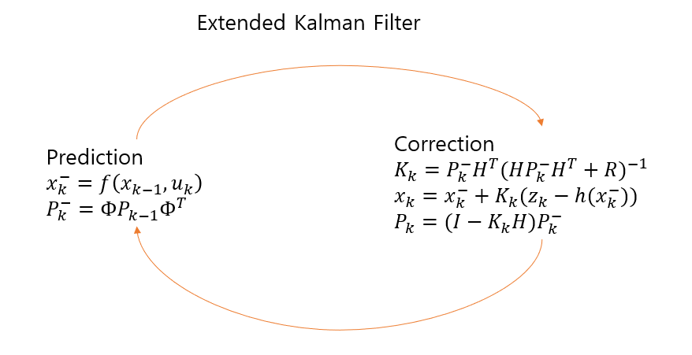
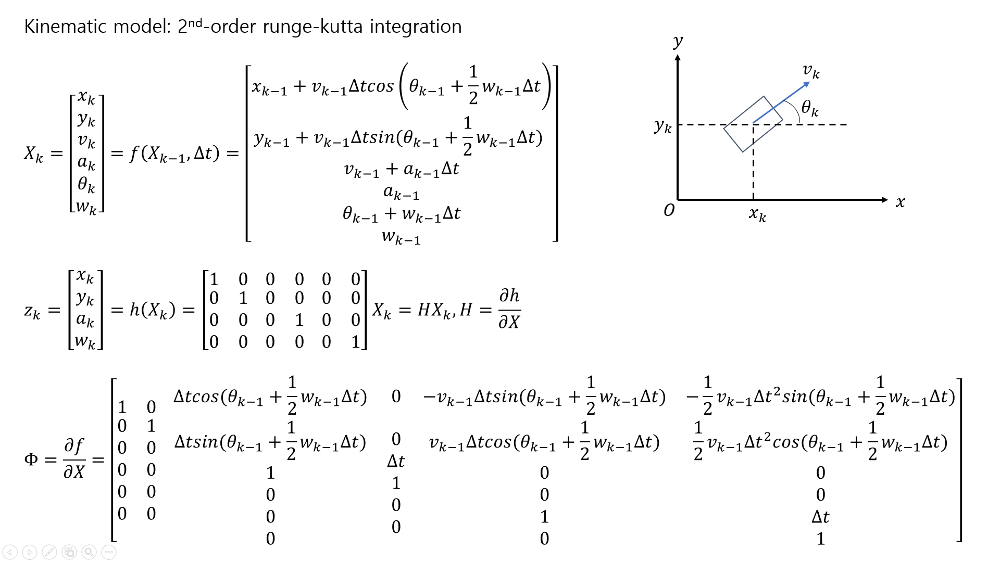

# EKF-kitti-GPS-IMU
Simple EKF with GPS and IMU data from kitti dataset for vehicle

## Usage
Just run below command at terminal
```
git clone https://github.com/dohyeoklee/EKF-kitti-GPS-IMU
cd src
python EKF_GPS_IMU.py
```
Dependency: 

-python 3.8.5

-numpy: 1.19.2

-matplotlib: 3.3.2

## Algorithm
**dataloder**

convert GPS data to local x,y frame data. Refer to: [2], [3]

I set dataset path as **src/oxts**. please change that path as you want.

**EKF(Extended Kalman Filter)**

In this code, I set state vector X = [x,y,v,a,phi,w], measurement vector z = [x,y,a,w]. Type of every matrix/vector except state vector X is numpy.mat type.

Get measurement vector from dataloader, add additional noise, and put it in the EKF algoruthm. Ground truth is [x,y] from dataset.




## Result
I use '2011_09_26_drive_0002' sync data


## Reference
[1] kitti dataset: http://www.cvlibs.net/datasets/kitti/raw_data.php

[2] haversine method(eng): https://www.movable-type.co.uk/scripts/latlong.html

[3] haversine method(kor): https://kayuse88.github.io/haversine/
